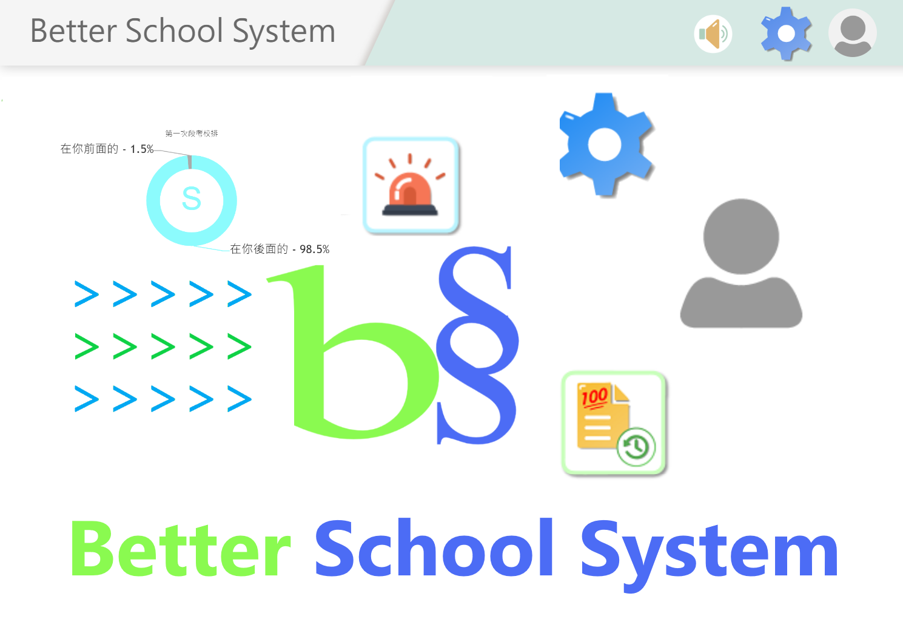

> 一個讓校務行政系統更好用的插件
<!-- $${\color{yellow}本專案之後有機會轉型為軟體}$$ -->

# 必要事項
- 必須安裝tampermonkey
- Chrome使用者必須在[插件管理員](chrome://extensions/)開啟**開發人員模式**

# 安裝
請見[安裝](https://github.com/KnowScratcher/Better-School-System/wiki/%E5%AE%89%E8%A3%9D)

# 原理
幫你加一些功能上去，像是保持登入，不會20分鐘就登出。

**簡單來說就是外掛**

# 出錯了嗎
到[這裡](https://github.com/KnowScratcher/Better-School-System/issues/new?assignees=&labels=bug&projects=&template=bug.yml)回報!

# 我想要新功能
到[這裡](https://github.com/KnowScratcher/Better-School-System/issues/new?assignees=&labels=enhancement&projects=&template=request.yml)提出!

# 加入我們的Discord追蹤進度
[點這個神奇的連結](https://discord.gg/gbHQWKqGde)

# 可用學校
✅為已測試
|學校|學生版|教師版|
|---|---|---|
|嘉義高中|✅|❓|
|嘉義女中|❓|❓|
|竹北高中|❓|❓|
|曙光女中|❓|❓|
|鳳山商工|❓|❓|
|成功工商|❓|❓|
|協同高中|❓|❓|
|羅浮高中|❓|❓|
|啟英高中|❓|❓|
|啟英高中|❓|❓|
|白河商工|❓|❓|
|民雄農工|❓|❓|
|大溪高中|❓|❓|
|興國高中|❓|❓|
|白河商工|❓|❓|
|鳳新高中|❓|❓|
|鹿港高中|❓|❓|
|北港農工|❓|❓|
|岡山農工|❓|❓|
|斗六家商|❓|❓|
|同德高中|❓|❓|
|新化高工|❓|❓|
|嘉陽高中進修部|❓|❓|
|平鎮高中|❓|❓|
|中興高中|❓|❓|
|興華高中|❓|❓|
|復興商工|❓|❓|
|苑裡高中|❓|❓|
|苗栗農工|❓|❓|
|國立南投高級中學|❓|❓|
|員林高中|❓|❓|
|彰化女中|❓|❓|
|竹東高中|❓|❓|
|新竹高工|❓|❓|
|彰化縣立成功高級中學|❓|❓|

若有已知使用亞昕校務系統的學校可以PR上來。

## 想要被測試嗎
我們的[開發貢獻方案](https://forms.gle/wtsEoCzBNqAYk6zB6)

# 感謝資料來源
若有不小心侵權，請[以email告知](mailto:yianlee2008@gmail.com)，我會儘快將該內容移除。
## 笑話
- [2023笑話大全 - 飄然](https://floatintheair.pixnet.net/blog/post/114189178)
- [2024笑話大全 - 飄然](https://floatintheair.pixnet.net/blog/post/67784866)
